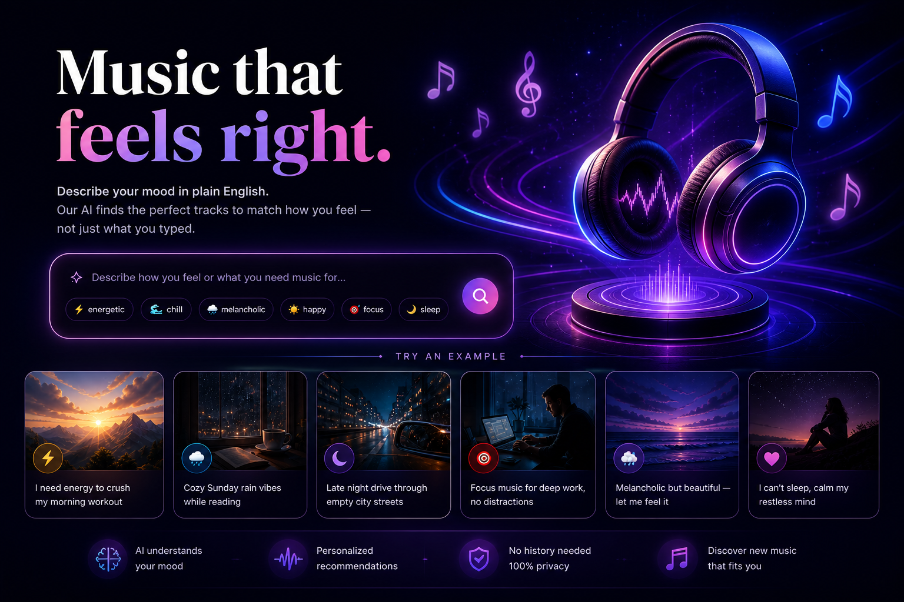

<div align="center">

# 🎵 Moodify — Emotion-Aware Music Intelligence

**Describe how you feel. Get a playlist that understands you.**

[](https://python.org)
[](https://nextjs.org)
[](https://fastapi.tiangolo.com)
[](https://supabase.com)
[](LICENSE)

<br/>



</div>

---

## What is Moodify?

Moodify is an end-to-end **emotion-aware music retrieval system** that bridges natural language, audio signal processing, and vector search. You type a mood or a feeling in plain English — *"I need energy to crush my morning workout"* or *"Late night drive through empty city streets"* — and the system returns a curated playlist that actually matches how you feel, not just keyword matches.

> Built as a Data Mining course project, it spans the full stack: audio DSP → unsupervised learning → semantic embeddings → RAG retrieval → FastAPI → Next.js UI.

---

## Architecture

```
 Deezer API                 Supabase (PostgreSQL + pgvector)
     │                              │
     ▼                              ▼
 Song Ingestion ──► Librosa DSP ──► K-Means Clustering ──► Embeddings
 (preview URLs)    (tempo, energy,  (emotion_cluster 0-7)  (MiniLM-L6-v2
                    brightness,                             → vector(1536))
                    valence, ...)
                                                                │
                                          Natural Language Query (user)
                                                                │
                                                    ┌───────────▼────────────┐
                                                    │  Intent Classification  │
                                                    │  Vibe → Target Ranges   │
                                                    │  Vector RPC (match_songs)│
                                                    │  Metadata Post-filter   │
                                                    │  Multi-factor Reranking │
                                                    └───────────┬────────────┘
                                                                │
                                                    FastAPI  ←──┘
                                                        │
                                                    Next.js UI (Moodify)
```

---

## Features

| Feature | Description |
|---|---|
| **Audio Feature Extraction** | DSP pipeline via `librosa` — tempo, energy, brightness, valence, danceability, and 7 more |
| **Emotion Clustering** | K-Means (k=4–8) with silhouette + CH + DB evaluation; 3D interactive visualization |
| **Semantic Embeddings** | `sentence-transformers/all-MiniLM-L6-v2` → zero-padded to `vector(1536)` for pgvector |
| **Smart Retrieval** | Query intent classification → target range inference → vector RPC → metadata post-filter → multi-factor reranking |
| **Transition Sequencing** | Cluster-aware playlist ordering for smooth emotional flow |
| **Live Preview URLs** | Deezer API refresh with `lru_cache` + parallel threads — no stale CDN links |
| **RAG MVP** | Local Ollama (`llama3`) + Supabase vector search for explainable playlist narration |
| **Glassmorphism UI** | Next.js 16 + Tailwind v4 + framer-motion — ambient animated background, stagger entrance, waveform player |
| **Retrieval Benchmark** | 20-prompt automated evaluation suite with cluster consistency, diversity, tempo/energy match metrics |

---

## Tech Stack

**Backend**
- Python 3.11, FastAPI, Uvicorn
- librosa, sentence-transformers, scikit-learn, pandas, numpy
- Supabase (PostgreSQL + pgvector), python-dotenv

**Frontend**
- Next.js 16 (App Router, Turbopack), TypeScript
- Tailwind CSS v4, shadcn/ui, framer-motion
- Custom glassmorphism design system

**Infrastructure**
- Supabase hosted PostgreSQL with `ivfflat` vector index
- Deezer Public API for song data + preview audio

---

## Project Structure

```
emotion-classifier/
├── api.py                        # FastAPI backend — playlist endpoint + preview refresh
├── retrieval_benchmark.py        # 20-prompt automated retrieval quality benchmark
├── emotion_model_benchmark.py    # Clustering method comparison (KMeans/GMM/Agglom)
├── deezer_store_deeser_songs.py  # Deezer ingestion → Supabase
├── deezer_enrich_deeser_songs.py # Librosa DSP feature extraction (chunked, resume-safe)
├── deezer_emotion_clustering.py  # K-Means clustering + Supabase sync + 3D visualization
├── generate_embeddings.py        # Text metadata → MiniLM embeddings → Supabase
├── rag_mvp_ollama.py             # Local RAG loop (Ollama llama3 + vector retrieval)
├── grid_search_retrieval.py      # Hyperparameter search for retrieval weights
├── extract_features.py           # Standalone audio feature extractor
├── deezer_preview_pipeline.py    # Preview URL pipeline utilities
├── streamlit_app.py              # Streamlit demo app
├── requirements.txt              # Python dependencies
├── supabase/schema.sql           # Full DB schema (tables, indexes, RPC, triggers)
├── emotion_clusters_3d.html      # Interactive 3D cluster visualization
├── cluster_summary.csv           # Cluster centroid statistics
├── clustering_metrics.json       # Silhouette / CH / DB scores
└── frontend/                     # Next.js 16 frontend (Moodify UI)
    ├── app/                      # App Router pages + global styles
    ├── components/               # Navbar, HeroSection, MoodBrowse, TrackCard, BottomPlayer
    └── lib/                      # API client, player context
```

---

## Quick Start

### 1. Clone & set up Python environment

```bash
git clone https://github.com/Brijesh03032001/EmotionClassifier.git
cd EmotionClassifier
python -m venv emclass && source emclass/bin/activate
pip install -r requirements.txt
```

### 2. Configure environment

Create a `.env` file:

```env
SUPABASE_URL=your_supabase_project_url
SUPABASE_SERVICE_ROLE_KEY=your_service_role_key
SUPABASE_TARGET_TABLE=deeser_songs
```

### 3. Run the data pipeline (one-time setup)

```bash
python deezer_store_deeser_songs.py      # Ingest songs from Deezer
python deezer_enrich_deeser_songs.py     # Extract audio features via librosa
python deezer_emotion_clustering.py      # Cluster into emotion groups
python generate_embeddings.py            # Generate + store vector embeddings
```

### 4. Start the backend

```bash
emclass/bin/uvicorn api:app --reload --port 8000
```

### 5. Start the frontend

```bash
cd frontend
npm install
# Create frontend/.env.local with: NEXT_PUBLIC_API_URL=http://localhost:8000
npm run dev
```

Open [http://localhost:3000](http://localhost:3000)

---

## Supabase Schema

The full schema lives in `supabase/schema.sql`. Key tables:

- **`deeser_songs`** — song metadata + all audio features + `emotion_cluster` + `embedding vector(1536)`
- **`match_songs` RPC** — pgvector cosine similarity search used by the retrieval pipeline

---

## Retrieval Pipeline (how it works)

1. **Intent classification** — detects `transition / functional / exploratory / single-mood` query types
2. **Vibe inference** — maps natural language to target `tempo`, `energy`, `brightness` ranges
3. **Vector search** — embeds the query with MiniLM → zero-pads to 1536 → calls `match_songs` RPC
4. **Metadata post-filter** — filters by cluster, tempo, energy windows
5. **Multi-factor reranking** — weighted score: `similarity × tempo_match × energy_match × cluster_bonus × diversity_penalty`
6. **Transition sequencing** — orders tracks for smooth cluster-to-cluster emotional arc

---

## Benchmark Results

Run the automated benchmark across 20 diverse prompts:

```bash
emclass/bin/python retrieval_benchmark.py
```

Evaluates: cluster consistency, intra-playlist diversity, tempo/energy range match, transition smoothness score.

---

## Screenshots

> Frontend running at `localhost:3000` with the glassmorphism Moodify UI, animated mood grid, and bottom audio player.

---

## License

MIT — feel free to fork, extend, and build on top of this.
